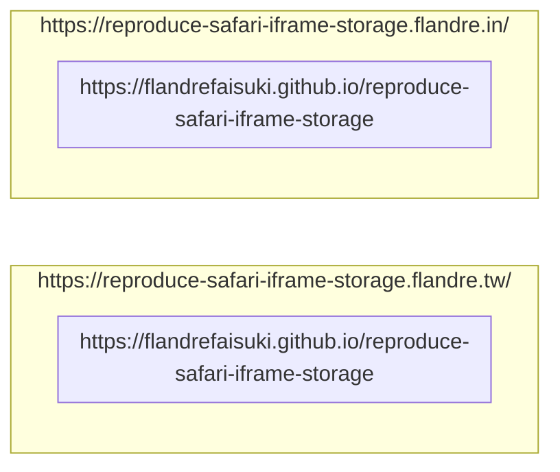

# reproduce-safari-iframe-storage

- [reproduce-safari-iframe-storage](#reproduce-safari-iframe-storage)
  - [Structure](#structure)
  - [Deployment](#deployment)
  - [Expected](#expected)
    - [Desktop Firefox non-private](#desktop-firefox-non-private)
    - [Desktop Firefox private](#desktop-firefox-private)
    - [Desktop Chromium-based non-private](#desktop-chromium-based-non-private)
    - [Desktop Chromium-based private](#desktop-chromium-based-private)
    - [MacOS Safari non-private](#macos-safari-non-private)
    - [MacOS Safari private](#macos-safari-private)
    - [Mobile iOS Safari non-private](#mobile-ios-safari-non-private)
    - [Mobile iOS Safari in-app (Line)](#mobile-ios-safari-in-app-line)
  - [Conclusion](#conclusion)

## Structure



## Deployment

```shell
npx wrangler pages publish ./main-frame \
  --project-name reproduce-safari-iframe-storage \
  --branch master \
  --commit-message 'success'
```

## Expected

We expect the iframe storage persistent in non-private mode & share between outer main frames.

I'll test by following steps:

1. Go [Main Frame (tw)](https://reproduce-safari-iframe-storage.flandre.tw/)
2. Add some key-value pairs to [iframe (github.io)](https://flandrefaisuki.github.io/reproduce-safari-iframe-storage) & [Main Frame (tw)](https://reproduce-safari-iframe-storage.flandre.tw/)
3. Close [Main Frame (tw)](https://reproduce-safari-iframe-storage.flandre.tw/)
4. Open both [Main Frame (in)](https://reproduce-safari-iframe-storage.flandre.in/) & [Main Frame (tw)](https://reproduce-safari-iframe-storage.flandre.tw/)
5. Observe results

### Desktop Firefox non-private

1. ✅ iframe (github.io) in Main Frame (tw): have values
2. ✅ Main Frame (tw): have values
3. ⚠️ iframe (github.io) in Main Frame (in): no values

### Desktop Firefox private

1. ✅ iframe (github.io) in Main Frame (tw): have values
2. ✅ Main Frame (tw): have values
3. ⚠️ iframe (github.io) in Main Frame (in): no values

### Desktop Chromium-based non-private

1. ✅ iframe (github.io) in Main Frame (tw): have values
2. ✅ Main Frame (tw): have values
3. ✅ iframe (github.io) in Main Frame (in): have values

### Desktop Chromium-based private

1. 🚫 iframe (github.io) in Main Frame (tw): DOMException
2. ✅ Main Frame (tw): have values
3. 🚫 iframe (github.io) in Main Frame (in): DOMException

### MacOS Safari non-private

1. ✅ iframe (github.io) in Main Frame (tw): have values
2. ✅ Main Frame (tw): have values
3. ⚠️ iframe (github.io) in Main Frame (in): no values

### MacOS Safari private

1. ⚠️ iframe (github.io) in Main Frame (tw): no values
2. ⚠️ Main Frame (tw): no values
3. ⚠️ iframe (github.io) in Main Frame (in): no values

### Mobile iOS Safari non-private

1. ✅ iframe (github.io) in Main Frame (tw): have values
2. ✅ Main Frame (tw): have values
3. ⚠️ iframe (github.io) in Main Frame (in): no values

### Mobile iOS Safari in-app (Line)

1. ⚠️ iframe (github.io) in Main Frame (tw): no values
2. ✅ Main Frame (tw): have values
3. ⚠️ iframe (github.io) in Main Frame (in): no values

## Conclusion

If you are the 3rd party iframe in iOS in-app webview, the localStorage will **NOT** work!
